<h1 align="center">Loom</h1>

<p align="center"><strong>Notebooks your AI can write. Pipelines it can run. One binary.</strong></p>

<p align="center">
Point Claude, Cursor, or any MCP-speaking agent at Loom and it comes back with a
<em>runnable, explainable</em> notebook — the SQL, the Python/TypeScript, the charts,
and the prose — backed by a real workflow run you can inspect. No Jupyter kernel to
babysit, no Postgres, no Kubernetes: a single Rust binary with SQLite inside.
</p>

<p align="center">
<a href="https://github.com/DanielMcSheehy/rust-orchestrator/actions/workflows/ci.yml"></a>
<a href="https://github.com/DanielMcSheehy/rust-orchestrator/actions/workflows/image.yml"></a>
<a href="LICENSE"></a>
<a href="https://github.com/DanielMcSheehy/rust-orchestrator/pkgs/container/rust-orchestrator"></a>


</p>

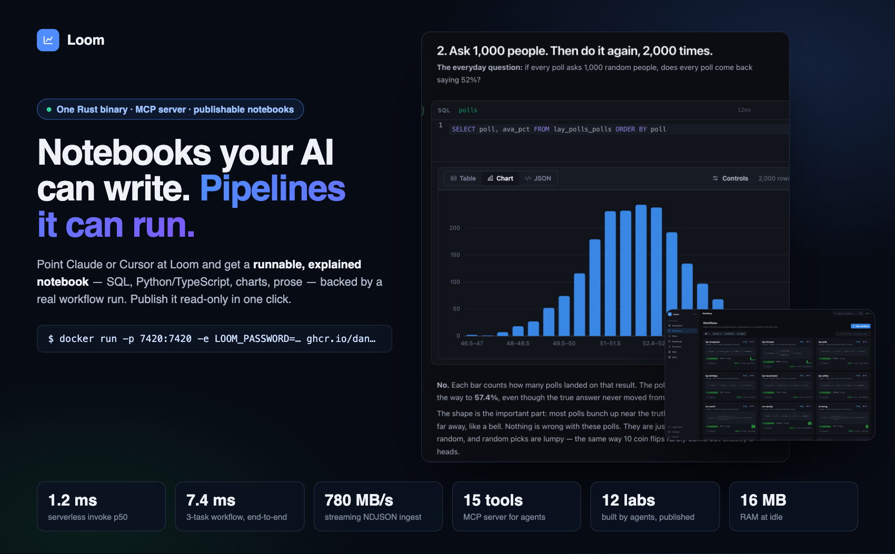

## 60-second demo

```bash
docker run -p 7420:7420 -e LOOM_PASSWORD=change-me ghcr.io/danielmcsheehy/rust-orchestrator
claude mcp add --transport http loom http://localhost:7420/mcp --header "Authorization: Bearer change-me"
```

Then ask your agent:

> *"Build me a lab notebook that teaches how gradient descent works: generate data, fit it with
> numpy and sklearn, show the loss curves for three learning rates, and explain the math."*

It will create a workflow, run it, ingest the results, query them with SQL, and write a notebook
with charts — all through the 15-tool MCP server. Open `http://localhost:7420` to watch it happen,
then hit **Publish** to share the finished notebook read-only.

## Built by agents, on Loom

Every notebook below was produced end to end by an AI agent talking to Loom's API — no human
touched the UI. Each one is a real Python + TypeScript DAG whose results were ingested, queried
with SQL, and charted in a teaching notebook.

| Lab | What it teaches |
| --- | --- |
| **Linear regression from the ground up** | Normal equation vs sklearn (match to 9e-14), gradient descent with a learning rate that diverges past the stability limit, Ridge/Lasso coefficient paths |
| **How a classifier decides** | Sigmoid, log-loss, decision boundary map, threshold sweep → ROC/AUC (0.9968 on breast-cancer), calibration vs tree and k-NN |
| **Overfitting, bias-variance, cross-validation** | Polynomials degree 1–15 on a noisy sine, bias²/variance from 200 bootstraps, k-fold picking the degree, learning curves |
| **How Shazam hears music** | Naive DFT vs radix-2 FFT (548× faster at N=4096), spectrogram, constellation hashes, matching a noisy clip |
| **PageRank on a synthetic web** | Power iteration, damping sweep, link farms losing to real authority |
| **Backprop from scratch** | A 2→36→36→1 MLP in TypeScript, chain rule written out, decision-boundary snapshots per epoch |

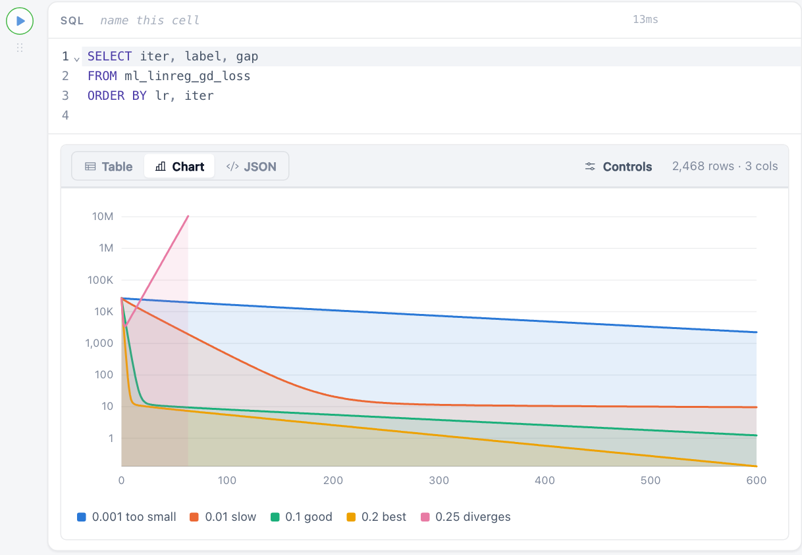

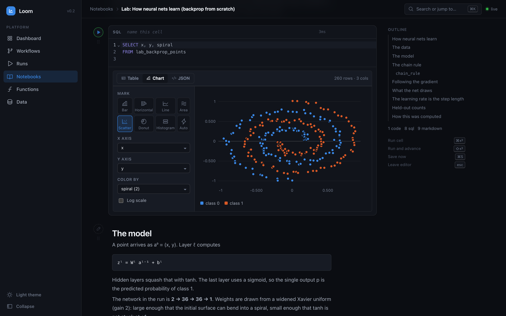

## Why Loom

| | Loom | Jupyter / marimo | Airflow / Prefect / Dagster | Windmill |
| --- | --- | --- | --- | --- |
| Agent-native API for the *whole* loop (code → data → SQL → notebook) | ✅ MCP + REST | notebook-only | pipeline-only | scripts/flows |
| Install | one binary / one container | Python env + kernel | broker + DB + scheduler | Postgres + workers |
| Python **and** TypeScript tasks in one DAG, results crossing languages | ✅ | — | Python | ✅ |
| SQL over results without pandas (embedded Polars) | ✅ | — | — | — |
| Notebooks with charts, reactive cells, data-aware autocomplete | ✅ | ✅ | — | — |
| Publish a notebook read-only with its outputs | ✅ | export | — | — |
| Cold-start overhead per task | ~1 ms (warm pool) | — | seconds | ~ms |

Loom is not trying to replace your production scheduler. It's the thing you reach for when
you want an agent — or yourself — to go from "I have a question about this data" to a
shareable, runnable, explained answer in one sitting.

## What it does

- **Workflow orchestration** — define DAGs of tasks, each task written in
  **Python, TypeScript, or JavaScript**. The Rust core validates the graph,
  topologically schedules it, runs independent tasks **in parallel**, and pipes
  each task's result into its dependents — across language boundaries (a
  Python task's output becomes a TypeScript task's input).
- **Process-isolated execution** — every task runs in its own OS process with
  a JSON-lines protocol over stdio. Timeouts kill runaway workloads; retries
  are per-task; logs stream back live.
- **Streaming everything** — run state, task state, and log lines broadcast
  over **SSE** (`/api/events`, `/api/runs/{id}/events`). Ingestion accepts
  **streamed NDJSON** bodies of any size without buffering them in memory.
- **Serverless functions** — deploy a named Python/TS/JS handler, invoke it
  over HTTP (`/api/functions/{name}/invoke`), or stream its logs + result via
  SSE. Invocation counts tracked per function.
- **SQL dataframe engine** — every ingested dataset is queryable with SQL,
  executed in-process by [Polars](https://pola.rs) (a Rust dataframe engine):
  `POST /api/query`, `client.query(...)` in both SDKs, a query panel in the
  console, and — inside any task or function — `loom.query(...)` bindings,
  so workloads aggregate millions of rows in Rust without pandas installed.
- **Triggers** — manual, interval (`every_secs`), or data-driven
  (`on_ingest: dataset` runs the workflow after every ingest batch).
- **Direct execution API** — `POST /api/execute` runs any Python/TS/JS
  snippet on the warm worker pool and returns result + logs in ~1 ms
  overhead; optional `inputs` become the handler's second argument. The
  building block for notebooks and agents.
- **Notebooks** — Observable-style executable documents in the console:
  markdown, code cells (any runtime), SQL cells, and charts in between.
  Cells run against the live platform and chain: each cell's output reaches
  the cells below as `inputs.prev` / `inputs[name]`, and in reactive mode
  the cells that read from a cell re-run automatically when it runs.
  Every tabular result gets a data grid with column profiles and a chart
  builder (bar, line, area, scatter, donut, histogram, stacking, colour by
  column); results, chart specs, and view state persist with the document.
- **External engines** — register **Postgres**, **ClickHouse**, or **chDB**
  (embedded ClickHouse) connectors and point any query — API, SDK, notebook
  cell, console — at them with `{"connector": "name"}`.
- **MCP server** — `POST /mcp` speaks the Model Context Protocol
  (streamable HTTP), exposing 15 tools (create/trigger/cancel workflows, execute
  code, SQL, ingest, dataset profiling, functions, notebooks) so AI agents can drive the whole
  platform: `claude mcp add --transport http loom http://localhost:7420/mcp`.
- **SDKs** — [Python](sdks/python) (`@task` decorators, zero deps) and
  [TypeScript](sdks/typescript) (`task()`/`flow()` builders, zero deps).
- **Console** — a real-time React UI with light and dark themes and a ⌘K
  command palette: DAG viewer, run Gantt timeline, live logs, run
  cancellation, notebooks, function playground, and a data catalog with
  server-side column profiles (`GET /api/datasets/{name}`) and a SQL
  workbench with schema hints and history.

## The console

Every screenshot below is the real UI, served by the binary itself.

### Notebooks: write a cell, run it, pick a chart

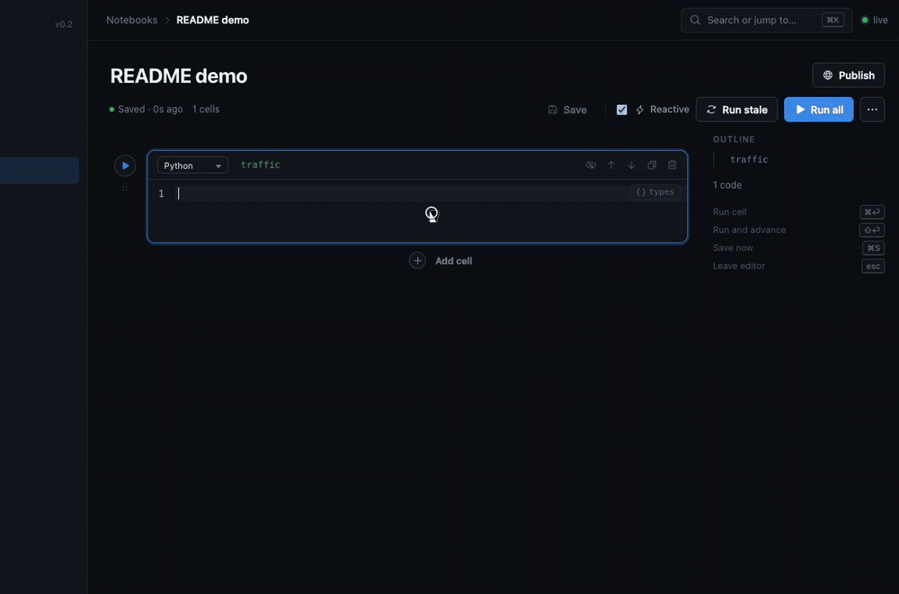

Return a DataFrame (or rows) and the output becomes a data grid with column profiles;
the Chart tab opens the controls — nine marks, colour by column, min/avg/max lines,
per-series colours — and the spec saves with the notebook.

### Workflows: see the DAG before you click

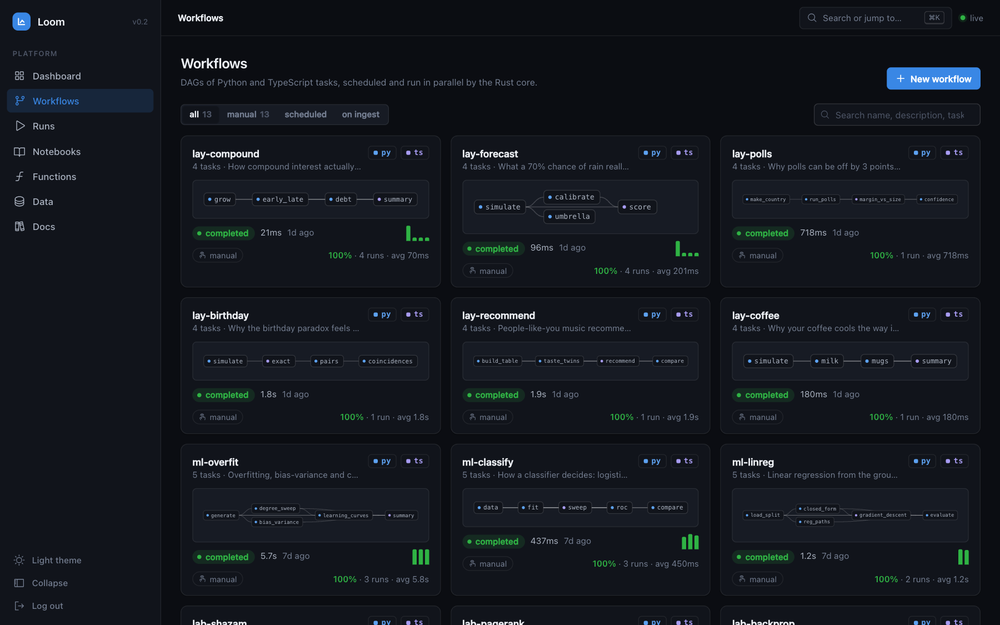

| Click a task for its code and results | Runs: Gantt timeline + expandable task results |
| --- | --- |
| 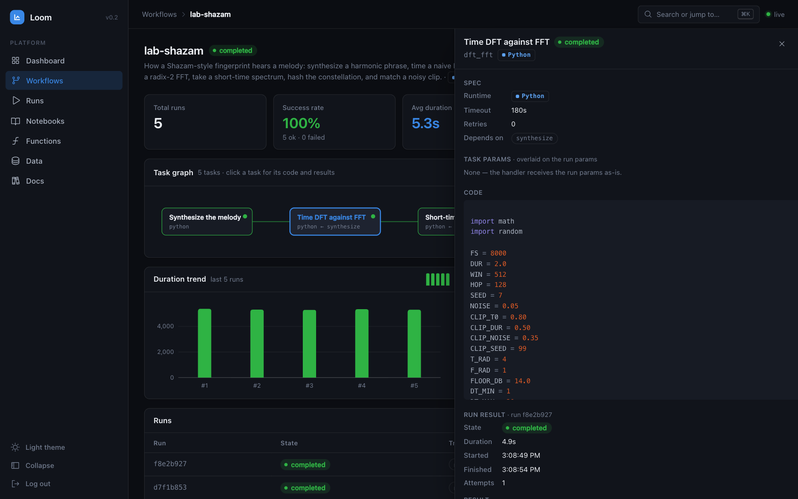 | 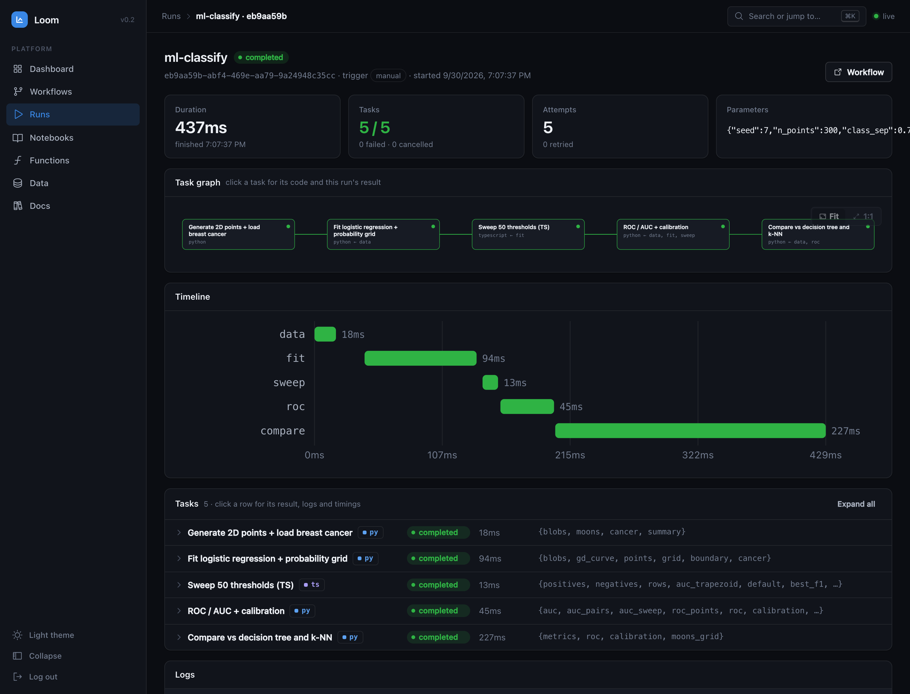 |

### Dashboard, data, functions

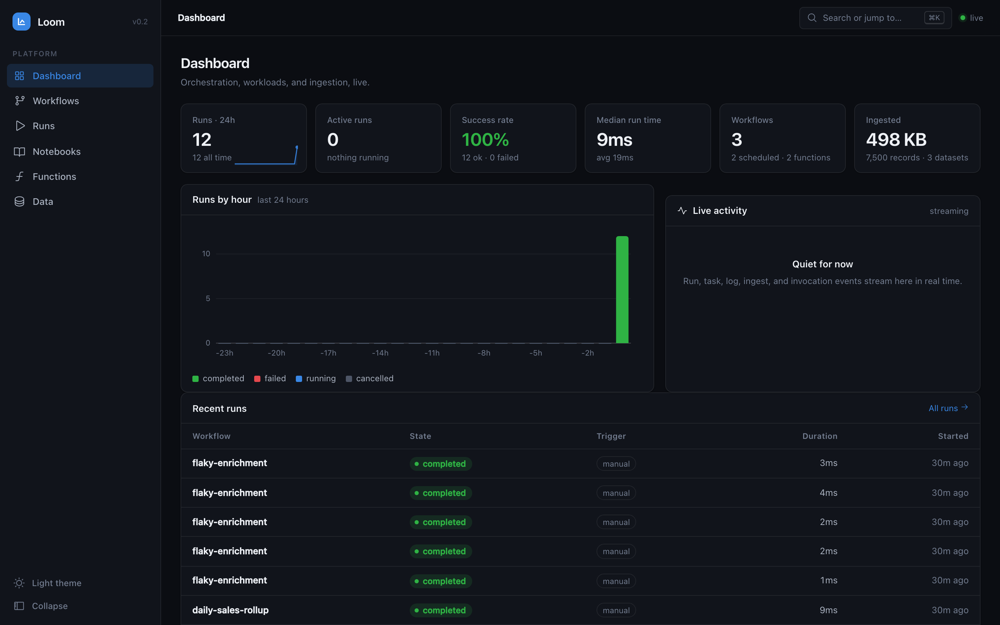

| Query | Invoke |
| --- | --- |
| 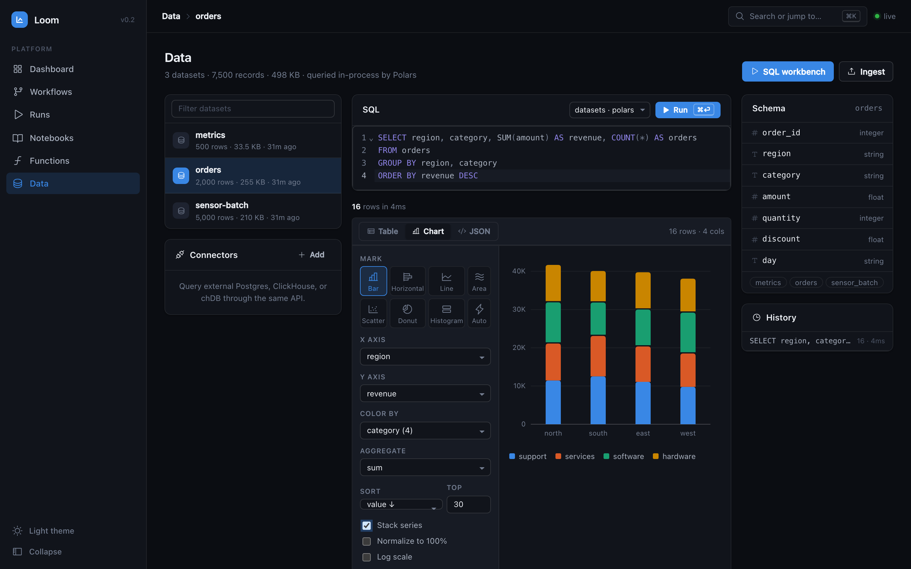 | 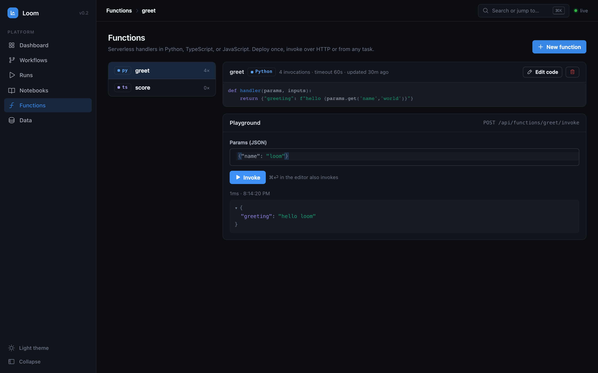 |

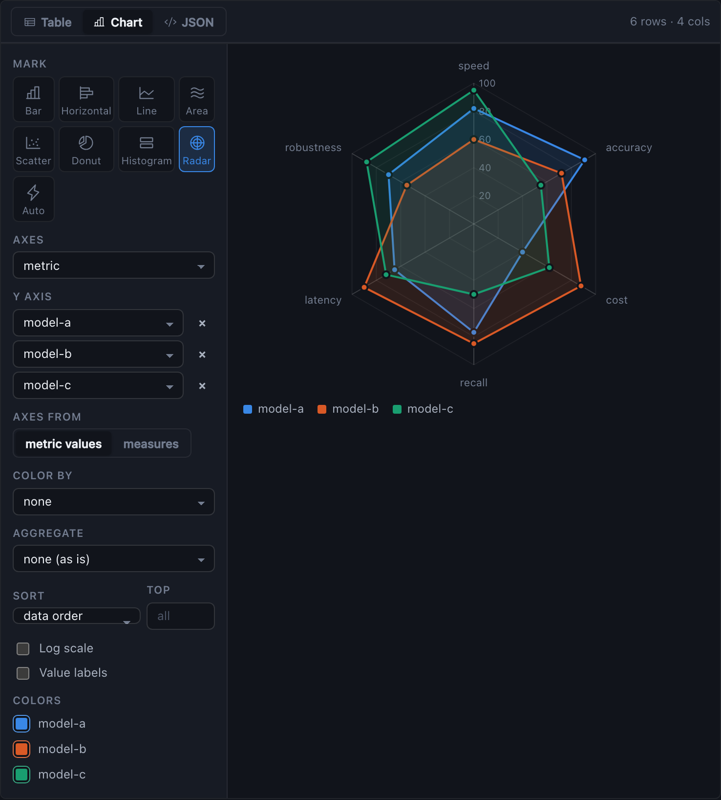

## Architecture


Crates:

| Crate | Role |
| --- | --- |
| [`loom-core`](crates/loom-core) | Domain model: workflows, tasks, runs, events, DAG validation + layering |
| [`loom-store`](crates/loom-store) | Embedded SQLite persistence (WAL), stats |
| [`loom-executor`](crates/loom-executor) | Process-isolated Python/Node workers, streamed logs, timeouts |
| [`loom-server`](crates/loom-server) | axum API, orchestrator, scheduler, SSE, ingestion, functions |

## Quickstart

Requirements: Rust 1.80+, Python 3.10+, Node 20+ (22+ for TypeScript tasks).

```bash
# 1. Run the server (API on :7420)
cargo run --release -p loom-server

# 2. Build + serve the console through the server
cd console && npm install && npm run build && cd ..
# restart the server — it auto-serves console/dist at http://localhost:7420

# — or for frontend development with hot reload:
cd console && npm run dev        # console on :3001, proxies /api to :7420
```

Or with Docker:

```bash
docker compose up --build        # everything on http://localhost:7420
```

### Deploy on Coolify

1. **+ New Resource → Docker Compose**, point it at this repository.
2. Set **Docker Compose Location** to `/docker-compose.coolify.yml`.
3. Assign a domain on the resource (or let Coolify generate one) — the
   `SERVICE_FQDN_LOOM` magic variable routes Coolify's proxy to the
   server, SSE included. Data persists in the `loom-data` volume and the
   healthcheck drives status/rolling restarts.

The image is built by GitHub Actions (`.github/workflows/image.yml`) and
published to `ghcr.io/danielmcsheehy/rust-orchestrator` (public), so the
Coolify host only pulls it — no Rust/polars compile on small servers. To
redeploy right after each image build, set the repo secrets
`COOLIFY_WEBHOOK` (the resource's Deploy Webhook URL) and `COOLIFY_TOKEN`
(an API token with deploy permission), and turn off Coolify's own
auto-deploy on push so it never pulls before the new image exists.

### Authentication & publishing

Set `LOOM_PASSWORD` and everything — API, MCP, console — requires it:

```bash
LOOM_PASSWORD=change-me cargo run --release -p loom-server   # or -e LOOM_PASSWORD=… in Docker/Coolify

curl -H 'Authorization: Bearer change-me' localhost:7420/api/workflows   # SDKs: LoomClient(url, token=…) or LOOM_API_TOKEN
```

The console shows a login screen and keeps a session cookie. Tasks and functions
calling `loom.query()` get the credential injected automatically.

**Published notebooks** are the one exception. Hit **Publish** on a notebook (or
`POST /api/notebooks/{id}/publish`) and anyone with the link can *read* it — cells,
stored outputs, charts — but nothing on a public page can execute, edit, or reach
any other data. Unpublish any time.

Leave `LOOM_PASSWORD` unset and Loom runs wide open, as a trusted single-tenant tool
on your own machine. Don't expose that to the internet.

### Your first workflow (curl)

```bash
curl -X POST localhost:7420/api/workflows -H 'content-type: application/json' -d '{
  "name": "hello-pipeline",
  "params": {"n": 100},
  "tasks": [
    {"id": "extract", "runtime": "python", "depends_on": [],
     "code": "def handler(params, inputs):\n    return {\"values\": list(range(params[\"n\"]))}\n"},
    {"id": "total", "runtime": "typescript", "depends_on": ["extract"],
     "code": "export function handler(params: any, inputs: any) {\n  return inputs.extract.values.reduce((a: number, b: number) => a + b, 0);\n}\n"}
  ]
}'

curl -X POST localhost:7420/api/workflows/<id>/trigger -H 'content-type: application/json' -d '{}'
curl localhost:7420/api/runs/<run_id>          # → task results, logs, states
curl -N localhost:7420/api/events              # → live SSE stream
```

### Your first workflow (Python SDK)

```python
from loom_sdk import LoomClient, Flow, task

@task
def extract(params, inputs):
    return {"values": list(range(params["n"]))}

@task(depends_on=[extract])
def total(params, inputs):
    return sum(inputs["extract"]["values"])

client = LoomClient("http://localhost:7420")
wf = client.deploy(Flow("hello-pipeline", params={"n": 100}, tasks=[extract, total]))
run = client.trigger(wf["id"], wait=True)      # → state: completed
```

See [`examples/`](examples) for runnable Python and TypeScript pipelines, and
the SDK READMEs for streaming, functions, and ingestion.

## HTTP API

| Method & path | Description |
| --- | --- |
| `GET /api/healthz` | Liveness |
| `GET /api/stats` | Aggregate counters |
| `GET/POST /api/workflows` | List / create (DAG-validated) |
| `GET/PUT/DELETE /api/workflows/{id}` | Read / update / delete |
| `POST /api/workflows/{id}/trigger` | Start a run (`{"params": {...}}`) |
| `GET /api/runs?workflow_id&limit` | Run history |
| `GET /api/runs/{id}` | Run + task states, results, logs |
| `POST /api/runs/{id}/cancel` | Cancel a pending/running run (202 + run; 409 if already terminal) |
| `GET /api/events`, `GET /api/runs/{id}/events` | **SSE** live event streams |
| `GET/POST /api/functions` | List / deploy serverless functions |
| `GET/DELETE /api/functions/{name}` | Read / remove |
| `POST /api/functions/{name}/invoke` | Invoke, JSON result + logs |
| `POST /api/functions/{name}/invoke/stream` | Invoke, **SSE** logs then result |
| `GET /api/datasets` | Ingested datasets |
| `GET /api/datasets/{name}?sample=N` | Column profile (dtype, nulls, min/max/mean, distinct) + first N rows |
| `DELETE /api/datasets/{name}` | Remove a dataset (file + registry) |
| `POST /api/ingest/{dataset}` | **Streaming** NDJSON ingestion |
| `POST /api/query` | SQL via embedded Polars, or `{"connector": name}` for Postgres/ClickHouse/chDB |
| `POST /api/execute` | Run a Python/TS/JS snippet on the warm pool (`{"runtime", "code", "params", "inputs"}`) |
| `GET/POST /api/connectors`, `DELETE /api/connectors/{name}` | External engine registry |
| `GET/POST /api/notebooks`, `GET/PUT/DELETE /api/notebooks/{id}` | Notebook documents (`?public=1` and public ids readable without auth) |
| `POST /api/notebooks/{id}/publish`, `…/unpublish` | Make a notebook readable by anyone with the link (never runnable) |
| `POST /api/auth/login`, `POST /api/auth/logout`, `GET /api/auth/status` | Session cookie for the console; `Authorization: Bearer <LOOM_PASSWORD>` everywhere else |
| `POST /mcp` | Model Context Protocol endpoint (15 tools for AI agents) |

## Writing tasks

A task is a self-contained module with one exported entrypoint:

```python
# runtime: python
def handler(params, inputs):
    # params: run params merged with task params
    # inputs: {upstream_task_id: its_result}
    print("logs stream live to the console")
    return {"any": "json"}
```

```ts
// runtime: typescript (Node 22 type-stripping) or javascript
export async function handler(params: any, inputs: any) {
  console.log("logs stream live");
  return { any: "json" };
}
```

Per-task knobs: `depends_on`, `retries`, `timeout_secs`, `params`. Workflow
knobs: `max_parallel_tasks`, `triggers.every_secs`, `triggers.on_ingest`.

Every task and function also gets **in-task platform bindings** — `import
loom` in Python, the `loom` global in JS/TS — for querying data on the
Rust engine, ingesting results, and invoking functions:

```python
import loom

def handler(params, inputs):
    rows = loom.query("""
        SELECT zone, AVG(value) AS avg_value, COUNT(*) AS n
        FROM telemetry WHERE value > 10 GROUP BY zone
    """)
    loom.ingest("zone-aggregates", rows)
    return {"zones": len(rows)}
```

## Development

Full environment setup, the Rust rebuild loop, and troubleshooting live in
[docs/development.md](docs/development.md). The short version:

```bash
cargo test --workspace      # Rust: DAG, store, executor (spawns real workers), orchestrator
cargo clippy --workspace
cd console && npm run typecheck && npm run build
cd sdks/typescript && npm run build
```

Configuration (env vars): `LOOM_PORT` (7420), `LOOM_DATA_DIR` (`./data`),
`LOOM_CONSOLE_DIST` (`./console/dist`), `LOOM_PYTHON_BIN` (`python3`),
`LOOM_NODE_BIN` (`node`), `LOOM_PASSWORD` (unset = no auth), `LOOM_SITE_DIR` (`./site`,
served at `/landing`), `RUST_LOG` (`info`).

The Docker image ships a Python venv with **numpy, pandas, scipy, and scikit-learn**
(`LOOM_PYTHON_BIN=/opt/loom-py/bin/python3`, BLAS/OpenMP pinned to one thread per worker).
Outside Docker, point `LOOM_PYTHON_BIN` at any venv to give handlers its packages.
Handlers may return numpy/pandas values directly — arrays and Series become lists,
DataFrames become row objects, and `NaN`/`±Infinity` become `null`.

## Performance

Measured on a modest dev container (release build, SQLite store, real Python
3.11 / Node 22 workers):

| Operation | p50 latency / throughput |
| --- | --- |
| Control-plane API call (`GET /api/stats`) | **0.6 ms** |
| Serverless invoke, Python | **1.2 ms** |
| Serverless invoke, JavaScript / TypeScript | **1.3 / 1.6 ms** |
| 3-task workflow (py → py → js), end to end | **7.4 ms** |
| Sustained parallel invocations (32 concurrent) | **~775 invocations/s** |
| Streaming NDJSON ingestion | **~780 MB/s** (1.7M records/100 MB in 0.13 s) |

The number that makes this possible is the **warm worker pool**: interpreters
are reused across tasks (the shims loop over jobs on stdin), so the
30–115 ms interpreter startup cost is paid once, not per task. Pooling is
automatic in `process` isolation mode; disable with `LOOM_WORKER_POOL=0`,
tune with `LOOM_WORKER_MAX_IDLE` (8 idle workers kept per runtime) and
`LOOM_WORKER_MAX_JOBS` (retire a worker after 128 jobs). Container and
microVM modes intentionally never pool — a fresh sandbox per task is their
purpose.

## Workload isolation

Workers run at one of three isolation tiers, selected with `LOOM_ISOLATION`.
All tiers speak the same stdio protocol — the orchestrator doesn't care which
one is active.

| Mode | What runs | Use when |
| --- | --- | --- |
| `process` (default) | direct child processes | trusted, single-tenant, lowest latency |
| `container` | one `docker`/`podman run --rm` per task: no network, read-only rootfs, memory/CPU/pid limits | semi-trusted code, dependency isolation |
| `microvm` | same container interface executed by a VM-backed OCI runtime (Kata Containers, Firecracker via `kata-fc`/firecracker-containerd) — each task gets its own guest kernel | untrusted / multi-tenant workloads |

```bash
# containers
LOOM_ISOLATION=container cargo run -p loom-server

# microVMs (requires a VM runtime registered with your engine, e.g. Kata)
LOOM_ISOLATION=microvm LOOM_VM_RUNTIME=io.containerd.kata.v2 cargo run -p loom-server
```

Container/microVM knobs: `LOOM_CONTAINER_ENGINE` (`docker`),
`LOOM_VM_RUNTIME` (`kata` when mode is `microvm`), `LOOM_PYTHON_IMAGE`
(`python:3.12-slim`), `LOOM_NODE_IMAGE` (`node:22-slim`),
`LOOM_WORKER_MEMORY` (`512m`), `LOOM_WORKER_CPUS` (`1`). Timed-out
workers are killed by container name so nothing is orphaned.

## Repository layout

```
crates/            Rust workspace (core, store, executor, server)
console/           React + Vite console
sdks/python/       loom-sdk (zero-dep Python bindings)
sdks/typescript/   @loom/sdk (zero-dep TS bindings)
examples/          Runnable example pipelines
docs/              Architecture notes & screenshots
site/              Landing page (single self-contained HTML — host it anywhere)
```

## Contributing

Issues and PRs welcome — especially new **labs**. A lab is a workflow + notebook that
teaches one technique with real numbers; if you build one with your agent of choice and
it renders cleanly, open a PR adding it to the table above with a link to the published
notebook. Run `cargo test --workspace`, `cargo clippy --workspace --all-targets`, and
`cd console && npm run build` before sending.

## License

[MIT](LICENSE).
